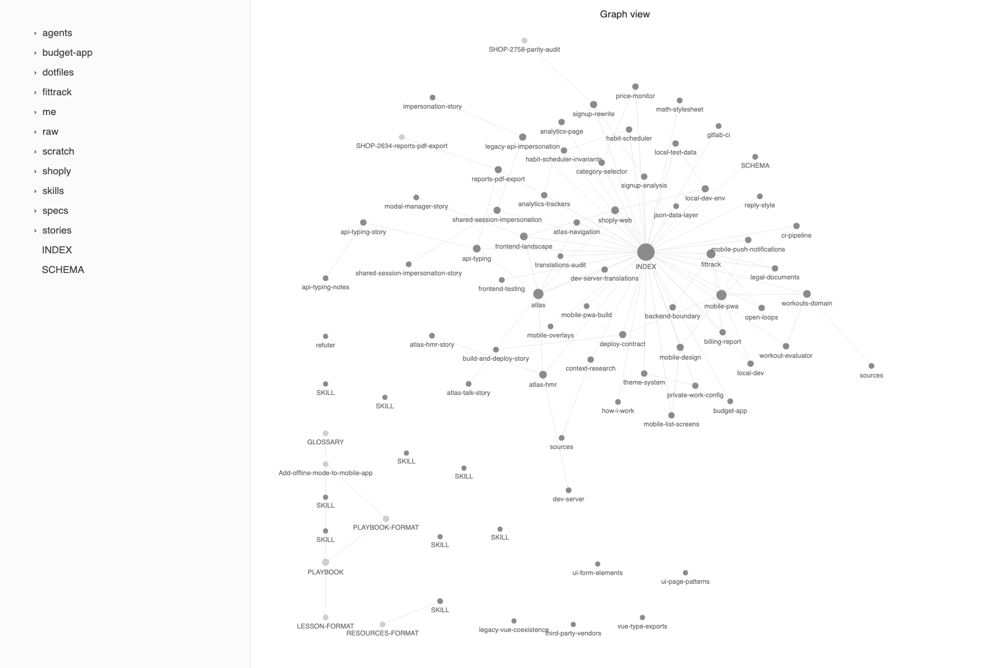

# Claude Vault Template

This is the memory system I use with Claude Code every day at work, packaged
so you can start from it. There is no tool here. It is a folder of markdown
files, some rules about how they get written, and a handful of skills that
enforce the rules. You can read the whole thing in an afternoon.



The problem it solves: every Claude Code session starts from zero. It doesn't
know how you work, what your projects look like, or what the last session
figured out. The popular fix is automatic memory, where the agent records
things as it goes. I tried that and watched it rot, because nothing ever
deletes anything, and after a month the memory is a pile of stale notes the
agent trusts more than the code. Even teams that build memory products for a
living have this problem in their own repos.

So this does it the boring way. Claude writes short pages when it actually
learns something. You review them the way you'd review a junior's notes, and
you delete freely, because everything is in git and history is the archive.
A lint script nags you when a page goes stale. The vault stays small on
purpose, and small is what keeps it trustworthy.

Everything is plain markdown, so it opens in [Obsidian](https://obsidian.md)
with working links and graph view. Obsidian is optional though. Any editor
works.

## How it works

The trick is that nothing is loaded blindly except two small files. Everything
else loads exactly when it's needed:

- **Two files load every session:** `me/how-i-work.md` (your conventions,
  boundaries, code style) and `INDEX.md` (the catalog). They get imported
  through `~/.claude/CLAUDE.md`, so every session starts knowing who you are
  and what pages exist.
- **Every other page loads by trigger.** Each page gets one line in
  `INDEX.md` that says when to open it. Like this:

  ```
  - [[payments-retry]] — Read when touching webhook retries or anything
    under billing/: the retry contract, the two traps in the queue config,
    why the delays are hardcoded. (work-state)
  ```

  Claude reads the index, matches the situation it's in, and opens only that
  page. This is what keeps a 50-page vault from costing 50 pages of context.
- **Knowledge about specific code paths doesn't go in the vault at all.** It
  goes in that repo's `.claude/rules/*.md`, which Claude Code loads on its
  own whenever a matching file is touched. A rule can't be missed. A vault
  page can, if its index line is vague. So anything tied to nameable paths
  becomes a rule, and the vault keeps what has no path, like "the local site
  502s when X" or "here's how our deploy actually works".
- **In-flight work goes in `scratch/`.** One file per project with the
  current branch and whatever is half-done. A small hook injects it at
  session start, so the next session resumes instead of re-deriving. This
  replaces Claude Code's auto-memory, which the setup turns off.

There are also two shelves Claude never reads on its own: `raw/` for source
material that pages cite, and `stories/` for write-ups of shipped work that
exist for your learning, not for retrieval.

The actual rulebook is [SCHEMA.md](SCHEMA.md). It defines what counts as junk,
the page genres and what maintaining each one means, and when Claude writes
without being asked. That file is the real product. Everything else in this
repo exists to serve it.

Before cloning anything, you can browse a lived-in example:
[claude-vault-demo](https://github.com/nemanjamalesija/claude-vault-demo) is
what a vault looks like after a couple of months on a real project. The
project in it is fictional, the structure and the writing rules are exactly
these. Start with its INDEX.md and compare a reference page against a
work-state page, that contrast is the whole system.

## Setup

```
# 1. Use this template to create a PRIVATE repo, then:
git clone <your-private-repo> ~/vault
cd ~/vault
./install.sh

# 2. Start Claude Code anywhere and run:
/vault-init
```

`install.sh` symlinks the skills and hooks into `~/.claude/` and adds an
import block to `~/.claude/CLAUDE.md`. If you clone somewhere other than
`~/vault`, it symlinks `~/vault` to the clone.

`/vault-init` is an interview, one question at a time: what you build, which
repos you work in, what Claude must never do on its own, how far it should
verify its own work, how you want it to talk to you. It writes your profile
from the answers, sets up the project folders, and wires the optional hooks,
each one only if you say yes.

Seriously, keep the repo private. It will hold employer and project details
within a week.

## What's inside

- `SCHEMA.md`, the rulebook.
- `INDEX.md`, the catalog with the trigger lines.
- `lint.sh`, free mechanical checks: dead links, pages missing from the
  index, finished work that nobody cleaned up, a vault that isn't pushed.
- `agents/refuter.md`, an agent that tries to disprove a claim before you act
  on it. Not vault-specific, but it earns its keep fast.
- `hooks/vault-scratch.sh`, the session-start hook for scratch pages.

And six skills. The two you'll actually live in:

- `/vault-init` — the setup interview.
- `/work-state-vault` — tracks an ongoing effort. Snapshots it for the next
  session, and when the branch lands, proposes where every fact goes and
  cleans the page up.

The maintenance crew, run occasionally:

- `/lint-vault` — the health check.
- `/dejunk-vault` — cuts noise that crept into pages.
- `/audit-vault` — reviews the system itself rather than the pages: measures
  what every session pays for the always-loaded files, checks the setup
  against published guidance on agent memory, and proposes changes.
- `/story-vault` — writes up shipped work for your own learning.

## How it fills up

Don't sit down and write your vault. Pages written from memory in one sitting
are mostly wrong, and you'll never trust the vault again. It fills through
work: you correct Claude and the correction becomes a page update, Claude
hits a weird build gotcha and files it, a session ends mid-branch and scratch
gets the state. After a week or two, run `/lint-vault` and prune together.

The healthy pattern, and this took me a while to internalize: pages about
ongoing work should shrink over time, not grow. As facts get proven they move
out to rules and reference pages, and what's left when the feature ships gets
deleted. A page that only ever grows is the signal that the system stopped
working.

To be clear about who does the work here: not you. `/work-state-vault` runs
that whole lifecycle. During a feature it snapshots where things stand, and
when you tell it a branch landed, it verifies the merge, walks the page fact
by fact, proposes what each one becomes, a repo rule, a reference page, or
deleted, and cleans everything up once you say yes. Same split everywhere:
Claude writes and proposes, the skills drive the routine, your job is reading
the proposals and saying yes or no.

MIT licensed. If you build something on top of this, I'd genuinely like to
hear about it.
